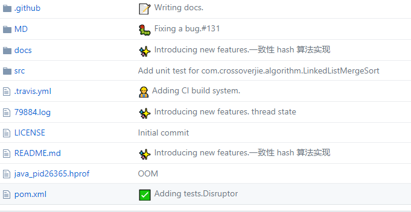
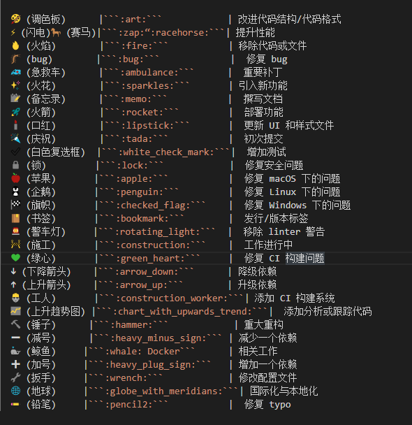

# git 提交github显示图标

使用git的开发者都知道提交代码的最简单命令： ```git commit -m '此次提交的内容说明'```。
我们在github发现了这样一张视图：



这是在commit时，添加了emoji表情说明，我们来看看其命令语法：


## 在commit时添加一个emoji表情图标
```git
git commit -m ':emoji: 此次提交的内容说明'
```

## 添加多个emoji表情图标

```git
git commit -m ':emoji1: :emoji2: :emoji3: 此次提交的内容说明'
```



在提交内容的前面增加了emoji标签：  **:emoji:**，其中emoji是表情图标的标签，列表见下面的附录表格。


|emoji|	emoji代码	|commit 说明
|----|----|----|
|:art: (调色板)|	```:art:```	|改进代码结构/代码格式
|:zap: (闪电):racehorse: (赛马)|	```:zap:“:racehorse:```	|提升性能
|:fire: (火焰)|	```:fire:```|	移除代码或文件
|:bug: (bug)|	```:bug:```	|修复 bug
|:ambulance: (急救车)|	```:ambulance:```|	重要补丁
|:sparkles: (火花)|	```:sparkles:```	|引入新功能
|:memo: (备忘录)	|```:memo:```	|撰写文档
|:rocket: (火箭)	|```:rocket:```	|部署功能
|:lipstick: (口红)	|```:lipstick:```	|更新 UI 和样式文件
|:tada: (庆祝)	|```:tada:```	|初次提交
|:white_check_mark: (白色复选框)	|```:white_check_mark:```	|增加测试
|:lock: (锁)	|```:lock:```	|修复安全问题
|:apple: (苹果)	|```:apple:```|	修复 macOS 下的问题
|:penguin: (企鹅)|	```:penguin:```|	修复 Linux 下的问题
|:checkered_flag: (旗帜)|	```:checked_flag:```	|修复 Windows 下的问题
|:bookmark: (书签)|	```:bookmark:```	|发行/版本标签
|:rotating_light: (警车灯)|	```:rotating_light:```	|移除 linter 警告
|:construction: (施工)|	```:construction:```	|工作进行中
|:green_heart: (绿心)	|```:green_heart:```	|修复 CI 构建问题
|:arrow_down: (下降箭头)	|```:arrow_down:```	|降级依赖
|:arrow_up: (上升箭头)|	```:arrow_up:```	|升级依赖
|:construction_worker: (工人)|	```:construction_worker:```	|添加 CI 构建系统
|:chart_with_upwards_trend: (上升趋势图)|	```:chart_with_upwards_trend:```	|添加分析或跟踪代码
|:hammer: (锤子)|	```:hammer:```	|重大重构
|:heavy_minus_sign: (减号)|	```:heavy_minus_sign:```|	减少一个依赖
|:whale: (鲸鱼)	|```:whale:```	|Docker 相关工作
|:heavy_plus_sign: (加号)|	```:heavy_plug_sign:```	|增加一个依赖
|:wrench: (扳手)	|```:wrench:```	|修改配置文件
|:globe_with_meridians: (地球)|	```:globe_with_meridians:```|	国际化与本地化
|:pencil2: (铅笔)|	```:pencil2:```|	修复 typo


查看：


编辑器查看的效果：

|----|----|----|
|🎨 (调色板)      |```:art:```            | 改进代码结构/代码格式
|⚡ (闪电)🐎 (赛马)|```:zap:“:racehorse:```| 提升性能
|🔥 (火焰)        |```:fire:```           | 移除代码或文件
|🐛 (bug)        |```:bug:```             |	修复 bug
|🚑 (急救车)      |```:ambulance:```      |	重要补丁
|✨ (火花)        |```:sparkles:```       |	引入新功能
|📝 (备忘录)      |```:memo:```           |	撰写文档
|🚀 (火箭)	       |```:rocket:```         |	部署功能
|💄 (口红)	       |```:lipstick:```       |	更新 UI 和样式文件
|🎉 (庆祝)	       |```:tada:```           |	初次提交
|✅ (白色复选框)	|```:white_check_mark:```|	增加测试
|🔒 (锁)	        |```:lock:```            |	修复安全问题
|🍎 (苹果)	      |```:apple:```           |	修复 macOS 下的问题
|🐧 (企鹅)	      |```:penguin:```         |	修复 Linux 下的问题
|🏁 (旗帜)	      |```:checked_flag:```    |	修复 Windows 下的问题
|🔖 (书签)	      |```:bookmark:```        |	发行/版本标签
|🚨 (警车灯)	    |```:rotating_light:```  |	移除 linter 警告
|🚧 (施工)	      |```:construction:```    |	工作进行中
|💚 (绿心)	      |```:green_heart:```     |	修复 CI 构建问题
|⬇️ (下降箭头)	   |```:arrow_down:```      |	降级依赖
|⬆️ (上升箭头)	   |```:arrow_up:```        |	升级依赖
|👷 (工人)	      |```:construction_worker:```|	添加 CI 构建系统
|📈 (上升趋势图)	|```:chart_with_upwards_trend:```|	添加分析或跟踪代码
|🔨 (锤子)	     |```:hammer:```            |	重大重构
|➖ (减号)	    |```:heavy_minus_sign:``` |	减少一个依赖
|🐳 (鲸鱼)	    |```:whale:	Docker```      | 相关工作
|➕ (加号)	   |```:heavy_plug_sign:```   |	增加一个依赖
|🔧 (扳手)	    |```:wrench:```            | 修改配置文件
|🌐 (地球)	    |```:globe_with_meridians:```| 国际化与本地化
|✏️ (铅笔)	    |```:pencil2:```           |	修复 typo
