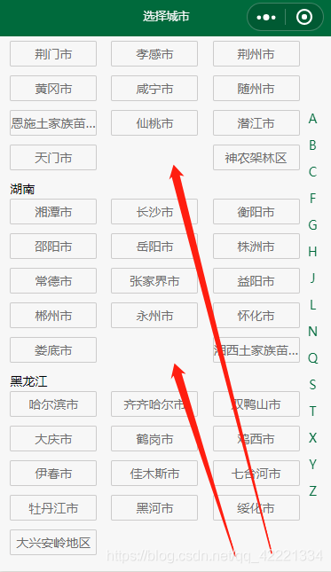
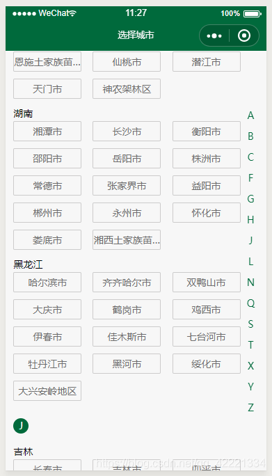
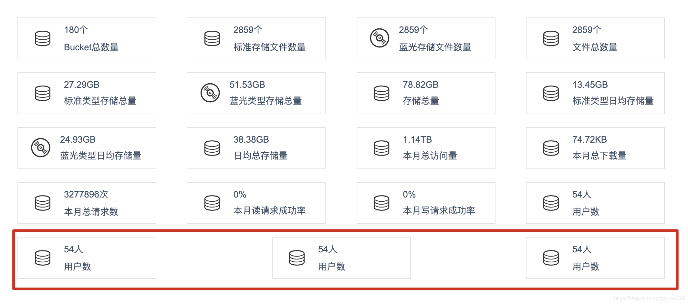

# flex 布局问题及解决

### 1. CSS用flex布局两端对齐，列不满左对齐

布局上要求两端对齐，且最后一行在列不满的情况下要求左对齐，使用flex的justify-content: space-between;
实现时发现最后一行不能左对齐，而是两端对齐方式



网上查了一些资料，有两种方法可以实现效果：

添加几个空item**（对我来说最有效的，适用于大多数场景）

 1. 根据布局列数添加空item，比如每行最大n列，那么在最后添加n-2个空item即可


```html
<html>
<style>
.box {
    display: flex;
    flex-wrap: wrap;
    justify-content: space-between;
}
.item {
    width: 30%;
    height: 50px;
    background-color: #f1f8ff;
    margin-bottom: 10px;
}
.placeholder {
    width: 30%;
    height: 0px;
}
</style>
<body>
  <div class="box">
    <div class="item"></div>
    <div class="item"></div>
    <div class="item"></div>
    <div class="item"></div>
    <div class="item"></div>
    <div class="placeholder"></div>
  </div>
</body>
</html>
```


 2. 利于after或者before（适用于每行3或者4列）**

```css
.box:after {
    display:block;
    content:"";
    width: 30%;
    height:0px;
}
```
完美：




在 vue 中如果遇到是多列的，比如下面这样




解决方式如下：放置占位元素,占位元素宽度与其他元素宽度一直,高度为0

```html

<style>
  .box {
    display: flex;
    flex-wrap: wrap;
    justify-content: space-between;
  }
  .box li {
    width: 24%;
    line-height: 40px;
    text-align: center;
  }
  /* 占位元素样式 */
  .temp {
    width: 24%;
    height: 0;
    margin-bottom: 0;
    border: none;
    padding: 0;
  }
</style>

<ul class="box">
  <li v-for="item in 8" :key='item' >售价：3000麦穗</li>
  <div class="temp" v-for="i in 6" :key="i">
    <!-- 占位元素， 感觉不够可以多循环几个,没啥影响 -->
  </div>
</ul>
```

ok, 解决：


