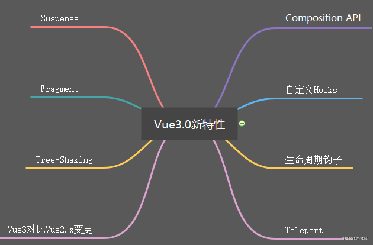
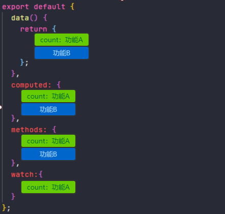
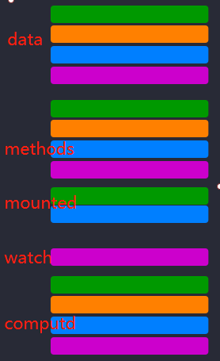
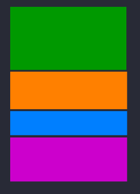
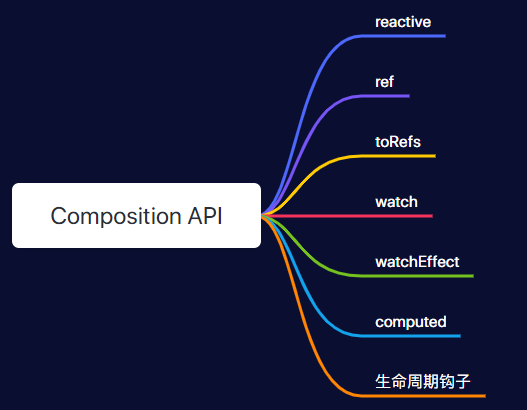
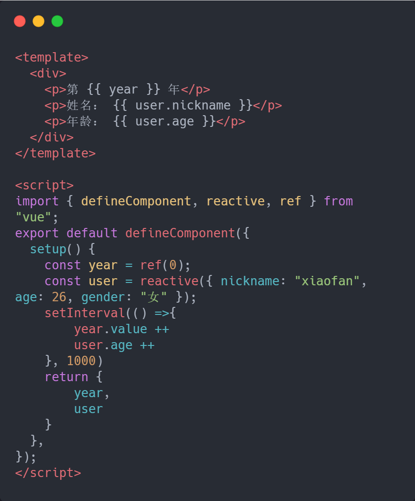
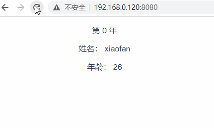
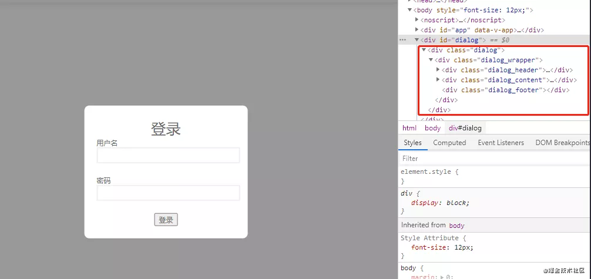

# Vue3.0 新特性以及使用变更总结

[参考资料](https://mp.weixin.qq.com/s/PVdOJUxn4bvfNOk0nCXGoA)


Vue3.0 在2020年9月正式发布了，也有许多小伙伴都热情的拥抱Vue3.0。2020年年底我们新项目使用Vue3.0来开发，这篇文章就是在使用后的一个总结， 包含Vue3新特性的使用以及一些用法上的变更。




### 为什么要升级Vue3

使用Vue2.x的小伙伴都熟悉，Vue2.x中所有数据都是定义在data中，方法定义在methods中的，并且使用this来调用对应的数据和方法。那Vue3.x中就可以不这么玩了， 具体怎么玩我们后续再说， 先说一下Vue2.x版本这么写有什么缺陷，所以才会进行升级变更的。


#### 回顾Vue2.x实现加减

```js
<template>
  <div class="homePage">
    <p>count: {{ count }}</p>
    <p>倍数： {{ multiple }}</p>
    <div>
        <button style="margin-right:10px" @click="increase">加1</button>
        <button @click="decrease">减一</button>
    </div>
  </div>
</template>

<script>
export default {
  data() {
    return {
      count: 0,
    };
  },

  computed: {
    multiple() {
      return 2 * this.count;
    },
  },

  methods: {
    increase() {
      this.count++;
    },
    decrease() {
      this.count++;
    },
  },
};
</script>
```

上面代码只是实现了对count的加减以及显示倍数， 就需要分别在data、methods、computed中进行操作，当我们增加一个需求，就会出现下图的情况：



当我们业务复杂了就会大量出现上面的情况， 随着复杂度上升，就会出现这样一张图， 每个颜色的方块表示一个功能：



甚至一个功能还有会依赖其他功能，全搅合在一起。

当这个组件的代码超过几百行时，这时增加或者修改某个需求， 就要在 data、methods、computed 以及 mounted 中反复的跳转，这其中的的痛苦写过的都知道。

那我们就想啊， 如果可以按照逻辑进行分割，将上面这张图变成下边这张图，是不是就清晰很多了呢, 这样的代码可读性和可维护性都更高：





那么vue2.x版本给出的解决方案就是Mixin, 但是使用Mixin也会遇到让人苦恼的问题：

 1. 命名冲突问题
 2. 不清楚暴露出来的变量的作用
 3. 逻辑重用到其他 component 经常遇到问题

关于上面经常出现的问题我就不一一举例了，使用过的小伙伴多多少少都会遇到。文章的重点不是Mixin,如果确实想知道的就留言啦~

所以，我们Vue3.x就推出了```Composition API```主要就是为了解决上面的问题，将零散分布的逻辑组合在一起来维护，并且还可以将单独的功能逻辑拆分成单独的文件。接下来我们就重点认识```Composition API```。


### Composition API




#### setup

setup 是 Vue3.x 新增的一个选项， 他是组件内使用 ```Composition API```的入口。

(1)``setup`` 执行时机

我在学习过程中看到很多文章都说 setup 是在 ```beforeCreate```和```created```之间， 这个结论是错误的。实践是检验真理的唯一标准， 于是自己去检验了一下：

```js
export default defineComponent({
  beforeCreate() {
    console.log("----beforeCreate----");
  },
  created() {
    console.log("----created----");
  },
  setup() {
    console.log("----setup----");
  },
});
```


setup 执行时机是在 beforeCreate 之前执行，详细的可以看后面生命周期讲解。

```warning：``` 由于在执行setup 时尚未创建组件实例，因此在 setup 选项中没有 this。


(2)```setup``` 参数

使用 setup 时，它接受两个参数：

  1. props: 组件传入的属性
  2. context


setup中接受的```props```是响应式的， 当传入新的props 时，会及时被更新。由于是响应式的， 所以不可以使用ES6解构，解构会消除它的响应式。

错误代码示例， 这段代码会让props不再支持响应式：

```js
// demo.vue
export default defineComponent ({
    setup(props, context) {
        const { name } = props
        console.log(name)
    },
})
```

那在开发中我们想要使用解构，还能保持```props```的响应式，有没有办法解决呢？大家可以思考一下，在后面```toRefs```学习的地方为大家解答。

接下来我们来说一下```setup```接受的第二个参数```context```，我们前面说了```setup```中不能访问Vue2中最常用的this对象，所以```context```中就提供了this中最常用的三个属性：```attrs```、```slot``` 和```emit```，分别对应Vue2.x中的 ```$attr```属性、```slot```插槽 和```$emit```发射事件。并且这几个属性都是自动同步最新的值，所以我们每次使用拿到的都是最新值。


### reactive、ref与toRefs

在vue2.x中， 定义数据都是在```data```中， 但是Vue3.x 可以使用```reactive```和```ref```来进行数据定义。

那么```ref```和```reactive```他们有什么区别呢？分别什么时候使用呢？说到这里，我又不得不提一下，看到很多网上文章说(```reactive```用于处理对象的双向绑定，```ref```则处理js基础类型的双向绑定)。我其实不太赞同这样的说法，这样很容易初学者认为```ref```就能处理js基本类型， 比如```ref```也是可以定义对象的双向绑定的啊， 上段代码：

```js
 setup() {
    const obj = ref({count:1, name:"张三"})
    setTimeout(() =>{
        obj.value.count = obj.value.count + 1
        obj.value.name = "李四"
    }, 1000)
    return{
        obj
    }
  }
```

我们将```obj.count```和```obj.name```绑定到页面上也是可以的；但是```reactive```函数确实可以代理一个对象， 但是不能代理基本类型，例如字符串、数字、boolean等。

接下来使用代码展示一下```ref、reactive```的使用：



运行效果:




上面的代码中，我们绑定到页面是通过```user.name```,```user.age```；这样写感觉很繁琐，我们能不能直接将```user```中的属性解构出来使用呢?答案是不能直接对```user```进行结构， 这样会消除它的响应式， 这里就和上面我们说```props```不能使用ES6直接解构就呼应上了。那我们就想使用解构后的数据怎么办，解决办法就是使用```toRefs```。


```toRefs```用于将一个```reactive```对象转化为属性全部为```ref```对象的普通对象。具体使用方式如下：

```js
<template>
  <div class="homePage">
    <p>第 {{ year }} 年</p>
    <p>姓名： {{ nickname }}</p>
    <p>年龄： {{ age }}</p>
  </div>
</template>

<script>
import { defineComponent, reactive, ref ,toRefs} from "vue";
export default defineComponent({
  setup() {
    const year = ref(0);
    const user = reactive({ nickname: "xiaofan", age: 26, gender: "女" });
    setInterval(() =>{
        year.value ++
        user.age ++
    }, 1000)
    return {
        year,
        // 使用reRefs
        ...toRefs(user)
    }
  },
});
</script>
```

## 生命周期钩子


我们可以直接看生命周期图来认识都有哪些生命周期钩子(图片是根据官网翻译后绘制的)：


从图中我们可以看到Vue3.0新增了setup，这个在前面我们也详细说了， 然后是将Vue2.x中的beforeDestroy名称变更成beforeUnmount; destroyed 表更为 unmounted，作者说这么变更纯粹是为了更加语义化，因为一个组件是一个mount和unmount的过程。其他Vue2中的生命周期仍然保留。

上边生命周期图中并没包含全部的生命周期钩子， 还有其他的几个， 全部生命周期钩子如图所示：


我们可以看到beforeCreate和created被setup替换了（但是Vue3中你仍然可以使用， 因为Vue3是向下兼容的， 也就是你实际使用的是vue2的）。其次，钩子命名都增加了on; Vue3.x还新增用于调试的钩子函数onRenderTriggered和onRenderTricked

下面我们简单使用几个钩子， 方便大家学习如何使用，Vue3.x中的钩子是需要从vue中导入的：

```js
import { defineComponent, onBeforeMount, onMounted, onBeforeUpdate,onUpdated, onBeforeUnmount, onUnmounted, onErrorCaptured, onRenderTracked, onRenderTriggered
} from "vue";

export default defineComponent({
  // beforeCreate和created是vue2的
  beforeCreate() {
    console.log("------beforeCreate-----");
  },
  created() {
    console.log("------created-----");
  },
  setup() {
    console.log("------setup-----");

    // vue3.x生命周期写在setup中
    onBeforeMount(() => {
      console.log("------onBeforeMount-----");
    });
    onMounted(() => {
      console.log("------onMounted-----");
    });
    // 调试哪些数据发生了变化
    onRenderTriggered((event) =>{
        console.log("------onRenderTriggered-----",event);
    })
  },
});
```

关于生命周期相关的内容就介绍到这里，下面我们介绍一下Vue3.x中```watch```有什么不同。

### watch 与 watchEffect 的用法

```watch``` 函数用来侦听特定的数据源，并在回调函数中执行副作用。默认情况是惰性的，也就是说仅在侦听的源数据变更时才执行回调。

```js
  watch(source, callback, [options])
```

参数说明：

- source:可以支持string,Object,Function,Array; 用于指定要侦听的响应式变量
- callback: 执行的回调函数
- options：支持deep、immediate 和 flush 选项。

接下来我会分别介绍这个三个参数都是如何使用的， 如果你对watch的使用不明白的请往下看：

侦听```reactive```定义的数据

```js
import { defineComponent, ref, reactive, toRefs, watch } from "vue";
export default defineComponent({
  setup() {
    const state = reactive({ nickname: "xiaofan", age: 20 });

    setTimeout(() =>{
        state.age++
    },1000)

    // 修改age值时会触发 watch的回调
    watch(
      () => state.age,
      (curAge, preAge) => {
        console.log("新值:", curAge, "老值:", preAge);
      }
    );

    return {
        ...toRefs(state)
    }
  },
});
```

侦听```ref```定义的数据

```js
const year = ref(0)

setTimeout(() =>{
    year.value ++ 
},1000)

watch(year, (newVal, oldVal) =>{
    console.log("新值:", newVal, "老值:", oldVal);
})
```

侦听多个数据

上面两个例子中，我们分别使用了两个watch, 当我们需要侦听多个数据源时， 可以进行合并， 同时侦听多个数据：

```js
watch([() => state.age, year], ([curAge, preAge], [newVal, oldVal]) => {
    console.log("新值:", curAge, "老值:", preAge);
    console.log("新值:", newVal, "老值:", oldVal);
});
```

侦听复杂的嵌套对象

我们实际开发中，复杂数据随处可见， 比如：

```js
const state = reactive({
    room: {
    id: 100,
    attrs: {
        size: "140平方米",
        type:"三室两厅"
    },
    },
});
watch(() => state.room, (newType, oldType) => {
    console.log("新值:", newType, "老值:", oldType);
}, {deep:true});
```

如果不使用第三个参数```deep:true```， 是无法监听到数据变化的。

前面我们提到，默认情况下，```watch```是惰性的, 那什么情况下不是惰性的， 可以立即执行回调函数呢？其实使用也很简单， 给第三个参数中设置```immediate: true```即可。关于```flush```配置，还在学习，后期会补充

```stop``` 停止监听


我们在组件中创建的```watch```监听，会在组件被销毁时自动停止。如果在组件销毁之前我们想要停止掉某个监听， 可以调用```watch()```函数的返回值，操作如下：

```js
const stopWatchRoom = watch(() => state.room, (newType, oldType) => {
    console.log("新值:", newType, "老值:", oldType);
}, {deep:true});

setTimeout(()=>{
    // 停止监听
    stopWatchRoom()
}, 3000)
```

还有一个监听函数```watchEffect```,在我看来```watch```已经能满足监听的需求，为什么还要有```watchEffect```呢？虽然我没有get到它的必要性，但是还是要介绍一下```watchEffect```，首先看看它的使用和watch究竟有何不同。

```js

import { defineComponent, ref, reactive, toRefs, watchEffect } from "vue";
export default defineComponent({
  setup() {
    const state = reactive({ nickname: "xiaofan", age: 20 });
    let year = ref(0)

    setInterval(() =>{
        state.age++
        year.value++
    },1000)

    watchEffect(() => {
        console.log(state);
        console.log(year);
      }
    );

    return {
        ...toRefs(state)
    }
  },
});
```

执行结果首先打印一次```state```和```year```值；然后每隔一秒，打印```state```和```year```值。

从上面的代码可以看出， 并没有像watch一样需要先传入依赖，watchEffect会自动收集依赖, 只要指定一个回调函数。在组件初始化时， 会先执行一次来收集依赖， 然后当收集到的依赖中数据发生变化时， 就会再次执行回调函数。所以总结对比如下：

1. ```watchEffect``` 不需要手动传入依赖
2. ```watchEffect``` 会先执行一次用来自动收集依赖
3. ```watchEffect``` 无法获取到变化前的值， 只能获取变化后的值

::: danger 留一个思考题：如果定义一个非响应式的值， watch和watchEffect可以监听到值的变化吗？:::

上面介绍了Vue3 Composition API的部分内容,还有很多非常好用的API, 建议直接查看官网composition-api。

其实我们也能进行自定义封装。


#### 自定义 Hooks

开篇的时候我们使用Vue2.x写了一个实现加减的例子， 这里可以将其封装成一个hook, 我们约定这些「自定义 Hook」以 use 作为前缀，和普通的函数加以区分。

```useCount.ts``` 实现：

```js
import { ref, Ref, computed } from "vue";

type CountResultProps = {
    count: Ref<number>;
    multiple: Ref<number>;
    increase: (delta?: number) => void;
    decrease: (delta?: number) => void;
};

export default function useCount(initValue = 1): CountResultProps {
    const count = ref(initValue);

    const increase = (delta?: number): void => {
        if (typeof delta !== "undefined") {
            count.value += delta;
        } else {
            count.value += 1;
        }
    };
    const multiple = computed(() => count.value *2 )

    const decrease = (delta?: number): void => {
        if (typeof delta !== "undefined") {
            count.value -= delta;
        } else {
            count.value -= 1;
        }
    };

    return {
        count,
        multiple,
        increase,
        decrease,
    };
}
```
接下来看一下在组件中使用```useCount```这个 hook:

```js
<template>
  <p>count: {{ count }}</p>
  <p>倍数： {{ multiple }}</p>
  <div>
    <button @click="increase()">加1</button>
    <button @click="decrease()">减一</button>
  </div>
</template>

<script lang="ts">
import useCount from "../hooks/useCount";
 setup() {
    const { count, multiple, increase, decrease } = useCount(10);
        return {
            count,
            multiple,
            increase,
            decrease,
        };
    },
</script>
```

开篇Vue2.x实现，分散在data,method,computed等， 如果刚接手项目，实在无法快速将data字段和method关联起来，而Vue3的方式可以很明确的看出，将count相关的逻辑聚合在一起， 看起来舒服多了， 而且```useCount```还可以扩展更多的功能。

项目开发完之后，后续还会写一篇总结项目中使用到的「自定义Hooks的文章」，帮助大家更高效的开发， 关于```Composition API```和自定义```Hooks```就介绍到这里， 接下来简单介绍一下vue2.x与vue3响应式对比。

### 简单对比vue2.x与vue3.x响应式

其实在Vue3.x 还没有发布beta的时候， 很火的一个话题就是Vue3.x 将使用```Proxy``` 取代Vue2.x 版本的 ```Object.defineProperty```。

没有无缘无故的爱，也没有无缘无故的恨。为何要将Object.defineProperty换掉呢，咋们可以简单聊一下。

我刚上手Vue2.x的时候就经常遇到一个问题，数据更新了啊，为何页面不更新呢？什么时候用```$set```更新，什么时候用```$forceUpdate```强制更新，你是否也一度陷入困境。后来的学习过程中开始接触源码，才知道一切的根源都是 ```Object.defineProperty```。

对这块想要深入了解的小伙伴可以看这篇文章 为什么Vue3.0不再使用defineProperty实现数据监听？要详细解释又是一篇文章，这里就简单对比一下Object.defineProperty 与Proxy

1. ```Object.defineProperty```只能劫持对象的属性， 而```Proxy```是直接代理对象
由于Object.defineProperty只能劫持对象属性，需要遍历对象的每一个属性，如果属性值也是对象，就需要递归进行深度遍历。但是Proxy直接代理对象， 不需要遍历操作

2. ```Object.defineProperty```对新增属性需要手动进行Observe
因为Object.defineProperty劫持的是对象的属性，所以新增属性时，需要重新遍历对象， 对其新增属性再次使用Object.defineProperty进行劫持。也就是Vue2.x中给数组和对象新增属性时，需要使用```$set```才能保证新增的属性也是响应式的, ```$set```内部也是通过调用```Object.defineProperty```去处理的。


### Teleport

Teleport是Vue3.x新推出的功能， 没听过这个词的小伙伴可能会感到陌生；翻译过来是```传送```的意思，可能还是觉得不知所以，没事下边我就给大家形象的描述一下。


```Teleport``` 是什么呢？

Teleport 就像是哆啦A梦中的「任意门」，任意门的作用就是可以将人瞬间传送到另一个地方。有了这个认识，我们再来看一下为什么需要用到Teleport的特性呢，看一个小例子：

在子组件Header中使用到```Dialog```组件，我们实际开发中经常会在类似的情形下使用到 Dialog ，此时Dialog就被渲染到一层层子组件内部，处理嵌套组件的定位、```z-index```和样式都变得困难。

Dialog从用户感知的层面，应该是一个独立的组件，从dom结构应该完全剥离Vue顶层组件挂载的DOM；同时还可以使用到Vue组件内的状态（data或者props）的值。简单来说就是,即希望继续在组件内部使用Dialog,又希望渲染的DOM结构不嵌套在组件的DOM中。

此时就需要Teleport上场，我们可以用<Teleport>包裹Dialog, 此时就建立了一个传送门，可以将Dialog渲染的内容传送到任何指定的地方。

接下来就举个小例子，看看Teleport的使用方式

```Teleport```的使用

我们希望Dialog渲染的dom和顶层组件是兄弟节点关系, 在index.html文件中定义一个供挂载的元素:

```html
<body>
<div id="app"></div>
+ <div id="dialog"></div>
</body>
```

定义一个Dialog组件Dialog.vue, 留意 to 属性， 与上面的id选择器一致：

```js
<template>
    <teleport to="#dialog">
        <div class="dialog">
            <div class="dialog_wrapper">
                <div class="dialog_header" v-if="title">
                    <slot name="header">
                        <span>{{title}}</span>
                    </slot>
                </div>
            </div>
            <div class="dialog_content">
                <slot></slot>
            </div>
            <div class="dialog_footer">
                <slot name="footer"></slot>
            </div>
        </div>
    </teleport>
</template>
```

最后在一个子组件Header.vue中使用Dialog组件,这里主要演示 Teleport的使用，不相关的代码就省略了。header组件

```js
<div class="header">
    ...
    <navbar />
+    <Dialog v-if="dialogVisible"></Dialog>
</div>
...
```



可以看到，我们使用 ```teleport``` 组件，通过 ```to``` 属性，指定该组件渲染的位置与 ```<div id="app"></div>``` 同级，也就是在 ```body``` 下，但是 ```Dialog``` 的状态 ```dialogVisible``` 又是完全由内部 Vue 组件控制.


### Suspense

```Suspense```是Vue3.x中新增的特性， 那它有什么用呢？别急，我们通过Vue2.x中的一些场景来认识它的作用。

Vue2.x中应该经常遇到这样的场景：

```html
<template>
<div>
    <div v-if="!loading">
        ...
    </div>
    <div v-if="loading">
        加载中...
    </div>
</div>
</template>
```

在前后端交互获取数据时， 是一个异步过程，一般我们都会提供一个加载中的动画，当数据返回时配合v-if来控制数据显示。

如果你使用过vue-async-manager这个插件来完成上面的需求， 你对Suspense可能不会陌生，Vue3.x感觉就是参考了vue-async-manager.

Vue3.x新出的内置组件Suspense, 它提供两个template slot, 刚开始会渲染一个fallback状态下的内容， 直到到达某个条件后才会渲染default状态的正式内容， 通过使用Suspense组件进行展示异步渲染就更加的简单。

:::warning 如果使用 Suspense, 要返回一个promise 

:::Suspense 组件的使用：

```html
  <Suspense>
      <template #default>
          <async-component></async-component>
      </template>
      <template #fallback>
          <div>
              Loading...
          </div>
      </template>
  </Suspense>
```

```asyncComponent.vue```:

```html
<template>
<div>
    <h4>这个是一个异步加载数据</h4>
    <p>用户名：{{user.nickname}}</p>
    <p>年龄：{{user.age}}</p>
</div>
</template>

<script>
import { defineComponent } from "vue"
import axios from "axios"
export default defineComponent({
    setup(){
        const rawData = await axios.get("http://xxx.xinp.cn/user")
        return {
            user: rawData.data
        }
    }
})
</script>
```

从上面代码来看，```Suspense``` 只是一个带插槽的组件，只是它的插槽指定了```default``` 和 ```fallback``` 两种状态。

### 片段（Fragment）

在 Vue2.x 中， template中只允许有一个根节点：

```html
<template>
    <div>
        <span></span>
        <span></span>
    </div>
</template>
```

但是在 Vue3.x 中，你可以直接写多个根节点， 是不是很爽：

```html
<template>
    <span></span>
    <span></span>
</template>
```


### 更好的 Tree-Shaking

Vue3.x 在考虑到 tree-shaking的基础上重构了全局和内部API, 表现结果就是现在的全局API需要通过 ES Module的引用方式进行具名引用， 比如在Vue2.x中，我们要使用 nextTick:

// vue2.x
import Vue from "vue"

Vue.nextTick(()=>{
    ...
})
Vue.nextTick() 是一个从 Vue 对象直接暴露出来的全局 API，其实 $nextTick() 只是 Vue.nextTick() 的一个简易包装，只是为了方便而把后者的回调函数的 this 绑定到了当前的实例。虽然我们借助webpack的tree-shaking,但是不管我们实际上是否使用Vue.nextTick(),最终都会进入我们的生产代码， 因为 Vue实例是作为单个对象导出的， 打包器无法坚持出代码总使用了对象的哪些属性。

在 Vue3.x中改写成这样：

import { nextTick } from "vue"

nextTick(() =>{
    ...
})


#### 受影响的 API

这是一个比较大的变化， 因为以前的全局 API 现在只能通过具名导入，这一更改会对以下API有影响：

+ Vue.nextTick
+ Vue.observable（用 Vue.reactive 替换）
+ Vue.version
+ Vue.compile（仅限完整版本时可用）
+ Vue.set（仅在 2.x 兼容版本中可用）
+ Vue.delete（与上同）


内置工具

出来上面的 API外， 还有许多内置的组件

:::warning 重要

以上仅适用于 ES Modules builds，用于支持 tree-shaking 的绑定器——UMD 构建仍然包括所有特性，并暴露 Vue 全局变量上的所有内容 (编译器将生成适当的输出，以使用全局外的 api 而不是导入)。:::

前面都是Vue3.0的一些新特性，后面着重介绍一下相对于Vue2.x来说， 有什么变更呢？


### slot 具名插槽语法

在Vue2.x中， 具名插槽的写法：

```html
<!--  子组件中：-->
<slot name="title"></slot>
```

在父组件中使用：

```html
<template slot="title">
    <h1>歌曲：成都</h1>
<template>
```

如果我们要在slot上面绑定数据，可以使用作用域插槽，实现如下：

```js
// 子组件
<slot name="content" :data="data"></slot>
export default {
    data(){
        return{
            data:["走过来人来人往","不喜欢也得欣赏","陪伴是最长情的告白"]
        }
    }
}

```

```html
<!-- 父组件中使用 -->
<template slot="content" slot-scope="scoped">
    <div v-for="item in scoped.data">{{item}}</div>
<template>
```

在Vue2.x中具名插槽和作用域插槽分别使用slot和slot-scope来实现， 在Vue3.0中将slot和slot-scope进行了合并同意使用。

Vue3.0中v-slot：

```html
<!-- 父组件中使用 -->
 <template v-slot:content="scoped">
   <div v-for="item in scoped.data">{{item}}</div>
</template>

<!-- 也可以简写成： -->
<template #content="{data}">
    <div v-for="item in data">{{item}}</div>
</template>
```

### 自定义指令

首先回顾一下 Vue 2 中实现一个自定义指令：

```js
// 注册一个全局自定义指令 `v-focus`
Vue.directive('focus', {
  // 当被绑定的元素插入到 DOM 中时……
  inserted: function (el) {
    // 聚焦元素
    el.focus()
  }
})
```

在Vue 2 中， 自定义指令通过以下几个可选钩子创建：

+ bind：只调用一次，指令第一次绑定到元素时调用。在这里可以进行一次性的初始化设置。
+ inserted：被绑定元素插入父节点时调用 (仅保证父节点存在，但不一定已被插入文档中)。
+ update：所在组件的 VNode 更新时调用，但是可能发生在其子 VNode 更新之前。指令的值可能发生了改变，也可能没有。但是你可以通过比较更新前后的值来忽略不必要的模板更新 (详细的钩子函数参数见下)。

+ componentUpdated：指令所在组件的 VNode 及其子 VNode 全部更新后调用。
+ unbind：只调用一次，指令与元素解绑时调用。

在Vue 3 中对自定义指令的 API进行了更加语义化的修改， 就如组件生命周期变更一样， 都是为了更好的语义化， 变更如下：


所以在Vue3 中， 可以这样来自定义指令：

```js
const { createApp } from "vue"

const app = createApp({})
app.directive('focus', {
    mounted(el) {
        el.focus()
    }
})

```

然后可以在模板中任何元素上使用新的 v-focus指令， 如下：

```html
<input v-focus />
```


### v-model 升级

在使用Vue 3 之前就了解到 v-model 发生了很大的变化， 使用过了之后才真正的get到这些变化， 我们先纵观一下发生了哪些变化， 然后再针对的说一下如何使用：

+ 变更：在自定义组件上使用v-model时， 属性以及事件的默认名称变了
+ 变更：v-bind的.sync修饰符在 Vue 3 中又被去掉了, 合并到了v-model里
+ 新增：同一组件可以同时设置多个 v-model
+ 新增：开发者可以自定义 v-model修饰符


有点懵？别着急，往下看 在Vue2 中， 在组件上使用 v-model其实就相当于传递了value属性， 并触发了input事件：

```html
<!-- Vue 2 -->
<search-input v-model="searchValue"><search-input>

<!-- 相当于 -->
<search-input :value="searchValue" @input="searchValue=$event"><search-input>
```

这时v-model只能绑定在组件的value属性上，那我们就不开心了， 我们就像给自己的组件用一个别的属性，并且我们不想通过触发input来更新值，在.async出来之前，Vue 2 中这样实现：

```js
// 子组件：searchInput.vue
export default {
    model:{
        prop: 'search',
        event:'change'
    }
}
```

修改后， searchInput 组件使用v-model就相当于这样：

```html
<search-input v-model="searchValue"><search-input>
<!-- 相当于 -->
<search-input :search="searchValue" @change="searchValue=$event"><search-input>
```

但是在实际开发中，有些场景我们可能需要对一个 prop 进行“双向绑定”， 这里以最常见的 modal为例子：modal挺合适属性双向绑定的，外部可以控制组件的visible显示或者隐藏，组件内部关闭可以控制 visible属性隐藏，同时visible 属性同步传输到外部。组件内部， 当我们关闭modal时, 在子组件中以update:PropName模式触发事件：

```js
this.$emit('update:visible', false)
```

然后在父组件中可以监听这个事件进行数据更新：

```html
<modal :visible="isVisible" @update:visible="isVisible = $event"></modal>
```

此时我们也可以使用v-bind.async来简化实现：

```html
<modal :visible.async="isVisible"></modal>
```

上面回顾了 Vue2 中v-model实现以及组件属性的双向绑定，那么在Vue 3 中应该怎样实现的呢？

在Vue3 中,在自定义组件上使用v-model,相当于传递一个modelValue 属性， 同时触发一个update:modelValue事件：

```html
<modal v-model="isVisible"></modal>

<!-- 相当于 -->
<modal :modelValue="isVisible" @update:modelValue="isVisible = $event"></modal>
```
如果要绑定属性名， 只需要给v-model传递一个参数就行, 同时可以绑定多个v-model：

```html
<modal v-model:visible="isVisible" v-model:content="content"></modal>

<!-- 相当于 -->
<modal 
    :visible="isVisible"
    :content="content"
    @update:visible="isVisible"
    @update:content="content"
/>
```

不知道你有没有发现，这个写法完全没有```.async```什么事儿了， 所以啊，Vue 3 中又抛弃了```.async```写法， 统一使用```v-model```


### 异步组件

Vue3 中 使用 ```defineAsyncComponent``` 定义异步组件，配置选项 component 替换为 loader ,Loader 函数本身不再接收 resolve 和 reject 参数，且必须返回一个 ```Promise```，用法如下：

```html
<template>
  <!-- 异步组件的使用 -->
  <AsyncPage />
</tempate>

<script>
import { defineAsyncComponent } from "vue";

export default {
  components: {
    // 无配置项异步组件
    AsyncPage: defineAsyncComponent(() => import("./NextPage.vue")),
    
    // 有配置项异步组件
    AsyncPageWithOptions: defineAsyncComponent({
   loader: () => import(".NextPage.vue"),
   delay: 200, 
   timeout: 3000,
   errorComponent: () => import("./ErrorComponent.vue"),
   loadingComponent: () => import("./LoadingComponent.vue"),
 })
  },
}
</script>

```

End